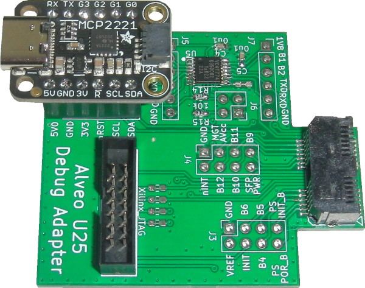
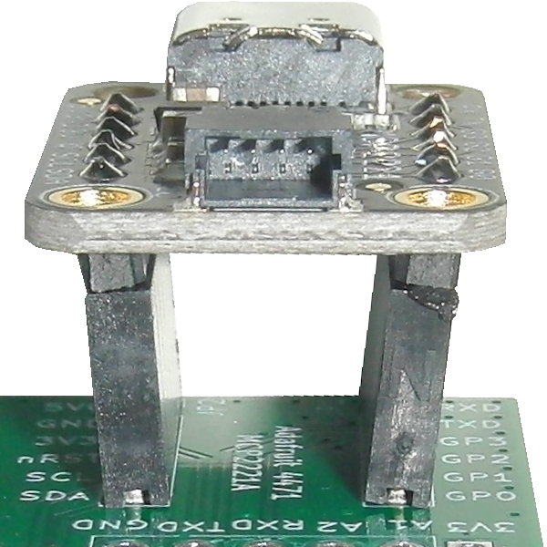
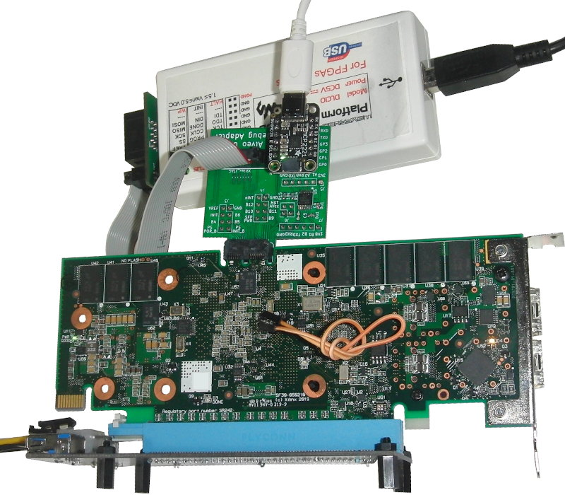
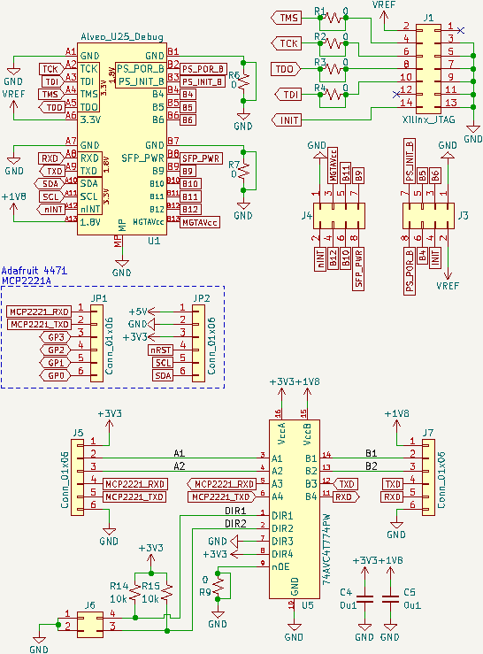
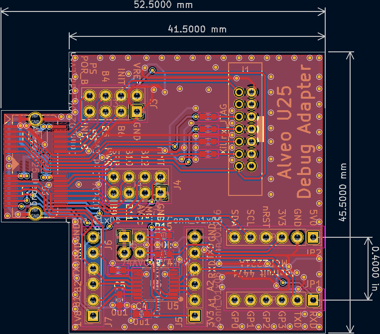

**Work-In-Progress** : [Design manufactured and works](https://github.com/mwrnd/AlveoU25_JTAG_Adapter/releases/download/v0.2-alpha/AlveoU25_JTAG_Adapter_Gerbers.zip) but a footprint is incorrect.

# AlveoU25_JTAG_Adapter

Alveo U25 Debug Connector to Xilinx JTAG, UART, and I2C.

The Adafruit 4471 footprint I used is off by 0.1". Its headers had to be soldered at an angle to work.

I have successfully used it to debug and program an Alveo U25.

The pinout is not available publicly so the signals had to be [traced out](https://github.com/mwrnd/alveo_u25_notes/blob/main/debug_log.md#figuring-out-the-jtag-debug-connector).

## Schematic

## PCB Layout

## Bill Of Materials

**Necessary:**

| Designator(s)    | Part Number          | Quantity | Footprint         | Availability                                                                |
| ---------------- | -------------------- | -------- | ----------------- | --------------------------------------------------------------------------- |
| U1               | MEC8-113-02-L-D-RA1  |        1 | MEC8-113-02-L-D   | [TrustedParts](https://www.trustedparts.com/en/search/MEC8-113-02-L-D-RA1)  |
| J1               | SBH21-NBPN-D07-ST-BK |        1 | SBH21-NBPN-D07-ST | [TrustedParts](https://www.trustedparts.com/en/search/SBH21-NBPN-D07-ST-BK) |
| U5               | 74AVC4T774PW         |        1 | TSSOP-16          | [TrustedParts](https://www.trustedparts.com/en/search/74AVC4T774PW)         |
| R14, R15         | RNCP0603FTD10K0      |        2 | 0603              | [TrustedParts](https://www.trustedparts.com/en/search/RNCP0603FTD10K0)      |
| C4, C5           | CL10B104JB8NNNC      |        2 | 0603              | [TrustedParts](https://www.trustedparts.com/en/search/CL10B104JB8NNNC)      |
| JP1, JP2         | PPTC061LFBN-RC       |        2 | 1x06_2.54mm       | [TrustedParts](https://www.trustedparts.com/en/search/PPTC061LFBN-RC)       |
| x                | Adafruit 4471        |        1 | None - Module     | [TrustedParts](https://www.trustedparts.com/en/part/adafruit/4471)          |

**Optional:**

| Designator(s)    | Part Number          | Quantity | Footprint         | Availability                                                                |
| ---------------- | -------------------- | -------- | ----------------- | --------------------------------------------------------------------------- |
| J5, J7           | PPTC061LFBN-RC       |        2 | 1x06_2.54mm       | [TrustedParts](https://www.trustedparts.com/en/search/PPTC061LFBN-RC)       |
| J3, J4           | PPTC042LFBN-RC       |        2 | 2x04_2.54x2.54mm  | [TrustedParts](https://www.trustedparts.com/en/search/PPTC042LFBN-RC)       |
| J6               | PREC002DAAN-RC       |        1 | 2x02_2.54mm       | [TrustedParts](https://www.trustedparts.com/en/search/PREC002DAAN-RC)       |
| x, x             | STC02SYAN            |          | None - Jumper     | [TrustedParts](https://www.trustedparts.com/en/search/STC02SYAN)            |

## Previous Version

[`v0.1-alpha`](https://github.com/mwrnd/AlveoU25_JTAG_Adapter/releases/tag/v0.1-alpha) was a basic breakout board for the Alveo U25 Debug Connector. It was never manufactured or tested.

Only two components would have been required: [MEC8-113-02-L-D-RA1](https://www.trustedparts.com/en/search/MEC8-113-02-L-D-RA1) and [SBH21-NBPN-D07-ST-BK](https://www.trustedparts.com/en/search/SBH21-NBPN-D07-ST-BK).

