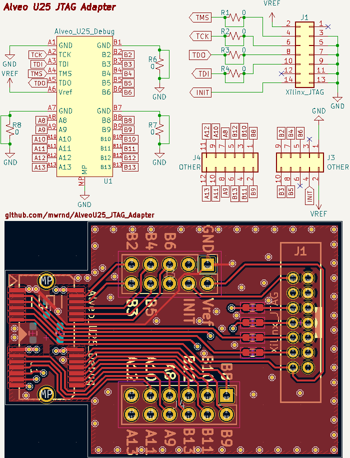

**Work-In-Progress** : [PCB Gerbers](https://github.com/mwrnd/AlveoU25_JTAG_Adapter/releases/download/v0.1-alpha/AlveoU25_JTAG_Adapter-Gerbers.zip) ready but not yet ordered.

# AlveoU25_JTAG_Adapter

Alveo U25 Debug Connector to Xilinx JTAG Adapter. The pinout is not available publicly so the signals had to be [traced out](https://github.com/mwrnd/notes/blob/main/Alveo_U25/debug_log.md#figuring-out-the-jtag-debug-connector).

For JTAG, only two components are required: [MEC8-113-02-L-D-RA1](https://www.trustedparts.com/en/search/MEC8-113-02-L-D-RA1) and [SBH21-NBPN-D07-ST-BK](https://www.trustedparts.com/en/search/SBH21-NBPN-D07-ST-BK).

Current State of Project:

Signals were traced:

